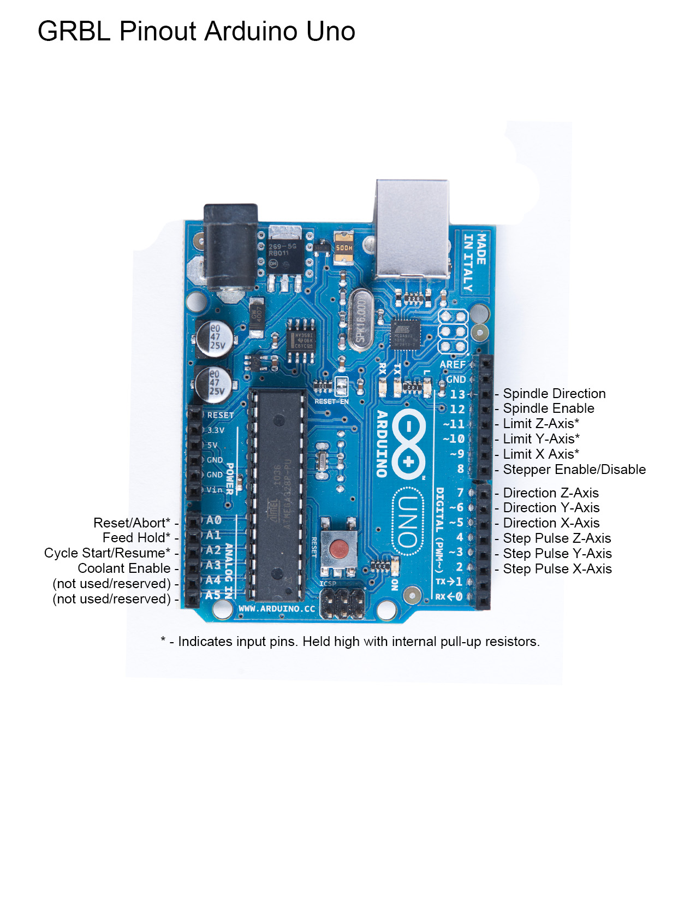
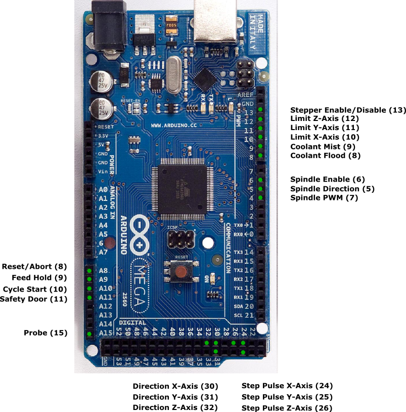
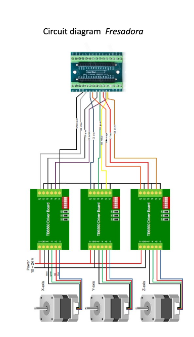

# Misc Lab Notes

Done during development


## Setup Millimeters for 3DTwin

Machine Work speed = 2500
Positioning speed = 3125
Acceleration = 125
X Axis step per mm 12.5
Y Axis step per mm 12.5
Z Axis step per mm 12.5


## Orientation Z Axis

`z0` is pen down 
`z10` is lift pen for 10mm


## Simple Annotated GCODE

```gcode
(Lift at start)
G0 Z10
(Set absolute coordiante system)
G90
(set to mm)
G21
(set the Feerate)
F1000 
(draw the rectangle)
G0 X10.5 Y10.5
G0 Z10
(pen down)
G1 Z0
G1 X209.5 Y10.5 Z0
G1 X209.5 Y209.5 Z0
G1 X10.5 Y209.5 Z0
G1 X10.5 Y10.5 Z0
(pen up)
G0 Z10
(go home)
G0 X0 Y0
```

## Din Formats in mm

When creating SVG files we use `1px === 1mm`.

| DIN A  | in mm         |
| :----- | :------------ |
| **0**  | 841 x 1189 mm |
| **1**  | 594 x 841 mm  |
| **2**  | 420 x 594 mm  |
| **3**  | 297 x 420 mm  |
| **4**  | 210 x 297 mm  |
| **5**  | 148 x 210 mm  |
| **6**  | 105 x 148 mm  |
| **7**  | 74 x 105 mm   |
| **8**  | 52 x 74 mm    |
| **9**  | 37 x 52 mm    |
| **10** | 26 x 37 mm    |

## Pinout Diagrams

Taken from this issue thread [Arduino Mega 2650 Pinout question?](https://github.com/grbl/grbl/issues/390).  






## Messages from MCU
